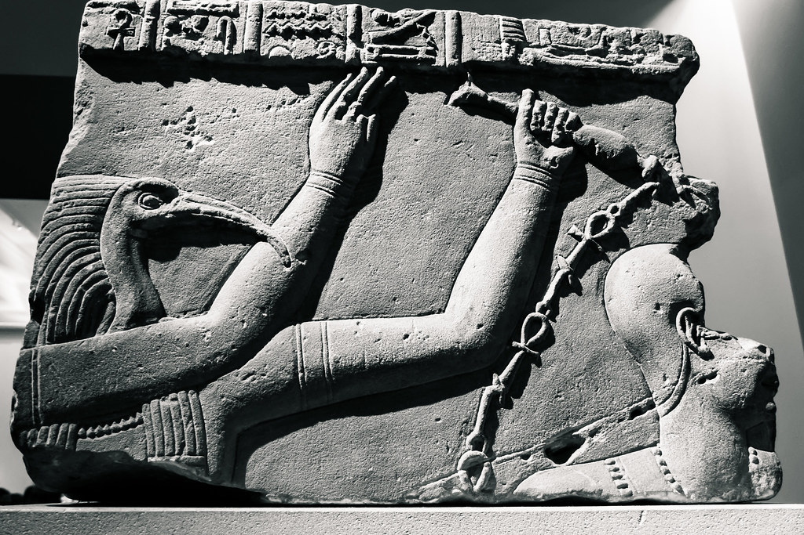

["Thoth"](https://www.flickr.com/photos/40632439@N00/27727234260) by [Thad Zajdowicz](https://www.flickr.com/photos/40632439@N00) is marked with [CC0 1.0](https://creativecommons.org/publicdomain/zero/1.0/?ref=ccsearch&atype=rich)

# Thoth 📖

What if a developer used a bit of [SRE](https://en.wikipedia.org/wiki/Site_reliability_engineering) to keep himself organized 🤔

This **CLI** accepts the chaos of our daily life and tries to convert it into a log stream that is similar to what we have in a Operating System.

Among other things **Thoth** is the Egyptian God of writing, magic, wisdom, science, equilibrium, balance, and the moon. I think that covers pretty much all realms we need to establish order on our daily life 😂
